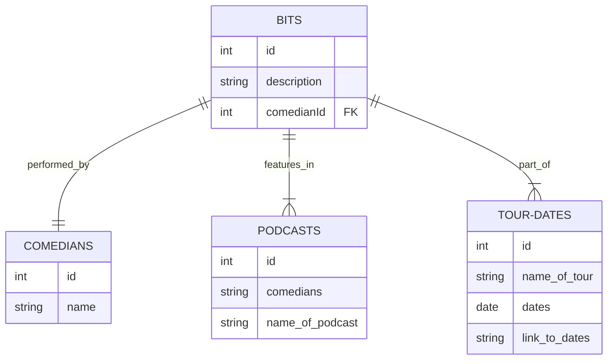

### Giggl

[Click here!](https://giggl-delta.vercel.app/) Discover laughs with giggl's comedy search engine, showcasing renowned comedians, their latest podcasts, and upcoming tour dates.

- Technologies used: Django, Python, Vite/Vue

- [Backend](https://giggl-backend-d1dba8cb813e.herokuapp.com/)

- [Trello Board](https://trello.com/invite/b/xYyOnwr0/ATTI8f7dcb8c3ad62cb3b70f0af151eec366A63335A2/giggl)

## Models 
### Bits
- Name of Comedian
- Description

### Comedians
- Name

### Podcasts
- Name
- Comedians

### Tour Dates
- Comedian
- Name of Tour
- Dates
- Link to Dates

| Plan                                              | Task                        |
|---------------------------------------------------|-----------------------------|
| Create model for comedian, podcast, and tour dates | Backend in Django/Heroku          |
| Set up UI                                         | Frontend in Vue/Vercel

## Screenshots
_Index_
_Create_
_Show_        

## UI Mock Up
_Index_

 
_Create/Update_

# Endpoints
## Bits
| Method | Route                 | Description                 |
|--------|-----------------------|-----------------------------|
| GET    | /api/bits             | Retrieve all bits           |
| POST   | /api/bits             | Add a new bit               |
| GET    | /api/bits/:id         | Retrieve a bit by ID        |
| PUT    | /api/bits/:id         | Update a bit by ID          |
| DELETE | /api/bits/:id         | Delete a bit by ID          |
| GET    | /api/bits/comedian/:id| Retrieve bits by comedian ID|

## Comedians
| Method | Route                 | Description                |
|--------|-----------------------|----------------------------|
| GET    | /api/comedians        | Retrieve all comedians     |
| POST   | /api/comedians        | Add a new comedian         |
| GET    | /api/comedians/:id    | Retrieve a comedian by ID  |

## Podcasts
| Method | Route                 | Description                |
|--------|-----------------------|----------------------------|
| GET    | /api/podcasts         | Retrieve all podcasts      |
| POST   | /api/podcasts         | Add a new podcast          |
| GET    | /api/podcasts/:id     | Retrieve a podcast by ID   |

## Tour Dates
| Method | Route                 | Description                |
|--------|-----------------------|----------------------------|
| GET    | /api/tour-dates       | Retrieve all tour dates    |
| POST   | /api/tour-dates       | Add a new tour date        |
| GET    | /api/tour-dates/:id   | Retrieve a tour date by ID |

## Understanding Vue

    

## Vue Terminology Explained

### **Reactivity**

- **Reactive properties**: Variables that automatically update the UI when they change.
  - Defined using: `data()` in Options API or `ref()`/`reactive()` in Composition API.

- **Computed properties**: Variables computed based on reactive properties, re-evaluated only when dependencies change.
  - Defined using: `computed` in both APIs.

- **Watchers**: Functions that observe and react to data changes.
  - Defined using: `watch` in both APIs.

### **Lifecycle Hooks**
- Hooks that allow you to run code at various stages of a component's life, such as before it's created or after it's mounted to the DOM.
  - Examples in Options API: `created()`, `mounted()`.
  - Examples in Composition API: `onCreated()`, `onMounted()`.

### **Methods**
- Functions associated with a Vue instance or component.
  - Defined within: `methods` object in Options API or directly within `setup()` function in Composition API.

### **Props**
- Custom attributes you can register on a component, useful for passing data from a parent component.
  - Declaration in Options API: `props: []` or `props: {}`.
  - Used within: `setup(props)` in Composition API.

### **Template Binding**
- The way to bind data to the DOM, making it reactive.
  - In Options API: Directly use option names.
  - In Composition API: Variables/methods must be returned from `setup()` to be accessible in the template.

### **Code Organization**
- How code is structured within a component or Vue instance.
  - Options API: Code is organized by option type.
  - Composition API: Offers flexibility in organization, often allowing grouping by feature or logic.

| Feature               | Options API                         | Composition API                        |
|-----------------------|------------------------------------|---------------------------------------|
| **Reactivity**        | `data()`, `computed`, `watch`      | `ref()`, `reactive()`, `computed()`, `watch()` |
| **Lifecycle Hooks**   | `created()`, `mounted()` etc.      | `onMounted()`, `onCreated()` etc.     |
| **Methods**           | Inside the `methods` object        | Just functions inside `setup()`       |
| **Props**             | `props: []` or `props: {}`         | `props` in `setup(props)`             |
| **Template Binding**  | Use direct option names            | Return from `setup()` to make available in template |
| **Code Organization** | Split by option type               | Organize by feature inside `setup()`  |

## ERD 

